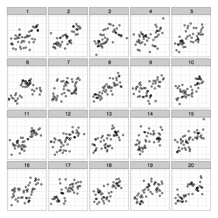
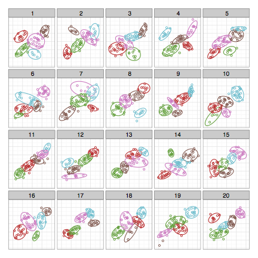
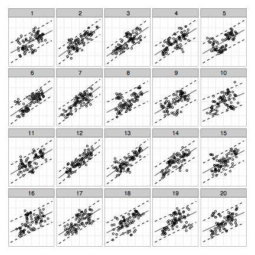
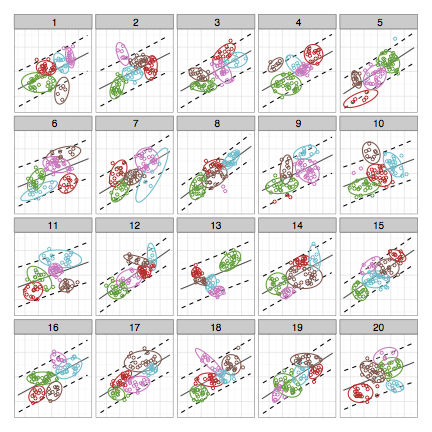

# Supplementary Materials for *Clusters beat Trend!? Testing feature hierarchy in statistical graphics*

***

**Authors:** [Susan VanderPlas](mailto:srvanderplas@gmail.com?subject=Feature%20Hierarchy%20Paper) and  [Heike Hofmann](mailto:hofmann@iastate.edu?subject=Feature%20Hierarchy%20Paper)

**Abstract:**
Graphics are very effective for communicating numerical information quickly and efficiently, but many of the design choices we make are based on subjective measures, such as personal taste or conventions of the discipline rather than objective criteria. In the [paper](Fullpaper/Revision/features-jcgs.pdf). We briefly introduce perceptual principles such as preattentive features and gestalt heuristics, and then discuss the design and results of a factorial experiment examining the effect of plot aesthetics such as color and trend lines on participants' assessment of ambiguous data displays. The quantitative and qualitative experimental results strongly suggest that plot aesthetics have a significant impact on the perception of important features in data displays. 

**Some Lineups and Designs:**

 

 

**Experiment:**
The webpage used to collect data from Amazon Turk participants is available [here (choose turk #16)](https://erichare.shinyapps.io/lineups/).

## Quick Links

This repository contains the data and code necessary to reproduce the images in the study, as well as the paper describing the study and results. 

* The [Code](Code) folder contains the R code necessary to generate pictures, format the data, and reproduce some of the initial analysis of the data. Some additional analysis code is embedded in the [Rnw file used to generate the paper](FullPaper/Revision/features-jcgs.Rnw).

* The [Data](Data) folder contains the data necessary to generate the images, as well as anonymized user data and simulation study results. See the [Rnw file used to generate the paper](FullPaper/Revision/features-jcgs.Rnw) to understand how these files fit into the analysis in context.

* The [Images](Images) folder contains the data sets and statistics about the data sets used to generate the lineups in this study.  

* The [svgs](svgs) folder contains the lineups shown to participants.

